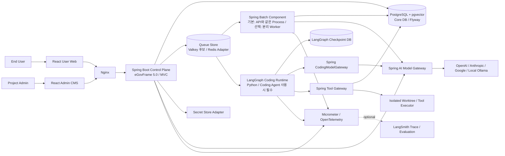

# AX Module Studio Spring AI Primary 목표 아키텍처 v0.2

> 작성일: 2026-08-10  
> 상태: 후보 — Spike Gate 통과 전 구현 금지  
> 선행 문서: `AX_Module_Studio_SPRING_AI_FEASIBILITY_ADR_v0.2.md`

---

## 1. 목표와 비목표

### 목표

- P0 제품·AI 기능을 eGovFrame 5.0 Boot·Spring AI·Spring Batch로 구현한다.
- Python은 P1 Coding Agent의 LangGraph 상태 그래프로 제한한다.
- 모든 LLM Provider Key와 Model Mapping을 Spring에서 단일 관리한다.
- 권한·승인·Version·Tool 실행·감사로그의 최종 기준을 Spring 업무 DB에 둔다.
- 일반 팀원은 Host JDK·Maven·외부 Tomcat 없이 Container로 실행한다.
- 기존 FastAPI 설계를 독립 Fallback 후보로 보존한다.

### 비목표

- Spring에서 LangGraph를 재구현하지 않는다.
- Python Runtime에 Public API나 업무 승인 권한을 주지 않는다.
- Spring AI를 권한 판정기나 DB Migration 도구로 사용하지 않는다.
- 두 Backend가 같은 DB를 공유하는 Hot Failover를 만들지 않는다.
- P0에서 Kubernetes, Kafka, 다중 VM을 도입하지 않는다.

---

## 2. 전체 구조



### 핵심 경계

```text
Spring
  Public API, 업무 Transaction, Product AI, RAG, Batch,
  Provider Secret, Model Registry, Tool Gateway, Approval

Python
  Coding Graph, Checkpoint, Interrupt, Resume, Node Routing

PostgreSQL Core DB
  업무 상태의 Source of Truth

LangGraph Checkpoint DB
  재개를 위한 보조 실행 상태

Queue Store
  전달·대기·Lock, 최종 상태 아님
```

---

## 3. Runtime 구성요소

| 구성요소 | 책임 | 명시적 금지 |
|---|---|---|
| Spring Control Plane | Public API, 인증·권한, CMS, Version, Approval, Publish, Job 생성 | 장시간 RAG Loop 직접 실행 |
| Spring AI Model Gateway | Provider·Model 선택, Chat·Embedding, Structured Output, Usage·Trace | 업무 Tool 무검증 자동 실행 |
| Spring Batch Component | Connector 수집, 정규화, Chunk, Embed, Index, Evaluate. P0 기본은 Spring API Process 내부의 비동기 실행 | HTTP 요청 Thread 점유, 승인 판정 |
| Spring Tool Gateway | Tool Allowlist, Role, Job State, PathPolicy, Hash, Approval 재검증 | LLM 판단 신뢰, 자유 Shell |
| LangGraph Coding Runtime | Coding Node·Edge, Checkpoint, Interrupt, Resume | Provider Key, Public API, DB DDL, Git/Docker Credential |
| Isolated Tool Executor | 허용된 Worktree의 Read/Patch/Test/Preview | 승인 없는 Push·Merge·Deploy |
| Core PostgreSQL | CMS·Job·Version·Audit·Batch Metadata·Vector | LangGraph 자동 DDL |
| Checkpoint PostgreSQL | LangGraph Checkpoint만 저장 | 업무 승인·활성 Version |
| Queue Store Adapter | Outbox 전달, Queue, Event, Lock | 업무 Source of Truth. Product DB 대체 |

### Spring API·Batch·Migration Source와 Container

Spring API와 Spring Batch는 **`urizo-final-backend`의 하나의 Spring Source·Application·Maven Build**에 둔다. Spring Batch는 별도 언어나 별도 Source가 아니라 같은 Spring Application의 업무 Component다.

현재 Toy MVP의 기본안은 API와 Batch를 하나의 `spring-app` Container에서 실행하는 것이다. API 요청은 Job을 등록하고 즉시 반환하며, 실제 수집·Chunk·Embedding·Index 작업은 요청 Thread가 아닌 제한된 비동기 Executor·Spring Batch `JobLauncher`가 처리한다.

```text
동일 Backend Source·Commit
→ Maven Build·Test 1회
→ spring-app Container
   ├── Spring MVC API·CMS·승인·RAG Query
   └── Spring Batch 수집·정규화·Chunk·Embedding·Index·평가

→ flyway-migration Container
   └── DDL 전용 One-shot, 성공 후 종료
```

Spring Runtime Role에는 업무 DML만 허용하고 DDL 권한은 주지 않는다. Migration Role만 Core DB DDL을 가진다. `spring-app`에서는 Flyway 자동 실행을 끄고 One-shot Migration Service 하나만 Schema 변경을 소유한다. Compose는 Migration 성공을 `service_completed_successfully`로 확인한 뒤 `spring-app`을 시작한다.

API와 Batch를 별도 Container로 나누는 것은 필수 Architecture가 아니라 운영 최적화다. 다음 중 하나가 실제 측정되면 같은 Source와 Image의 `api`·`worker` Profile로 분리한다.

- Batch 실행 중 API 응답시간·Memory·CPU가 허용 기준을 넘음
- API 배포·재시작과 장시간 Job 실행을 독립시켜야 함
- API와 Batch를 서로 다른 수로 Scale해야 함
- DB Role·Network·Resource Limit을 더 엄격히 분리해야 함
- Worker 장애가 API Health에 영향을 주면 안 됨

분리하더라도 Source·Domain·Contract·Flyway는 같은 Backend Repository에 유지한다. 즉, **기본은 한 Container, 필요가 측정되면 같은 Source를 두 Process로 분리**한다.

---

## 4. 제품 기능 배치

### 4.1 Connector

```text
관리자 자연어·Sample 응답
→ Spring AI가 ConnectorSpec Mapping 초안 생성
→ Java JSON Schema·Host Allowlist·Parameter Policy 검증
→ 관리자 Draft 저장
→ 승인된 Connector로 Spring Batch 수집
```

- 외부 HTTP는 Spring `RestClient` 또는 `WebClient`가 담당한다.
- Pagination, Rate Limit, Retry, Timeout, Host Allowlist는 결정적 코드다.
- LLM은 URL을 자유롭게 만들거나 Secret을 읽지 않는다.
- 공공 API별 Local 테스트 데이터는 팀원 DB마다 독립 유지한다.

### 4.2 Knowledge Build·RAG

```text
Knowledge Build 요청
→ Core DB Job + Outbox 원자 저장
→ Queue Store 전달
→ Spring Batch COLLECT
→ NORMALIZE
→ CHUNK
→ EMBED
→ INDEX
→ RETRIEVAL_TEST
→ EVALUATE
→ APPROVAL_PENDING
→ 관리자 승인
→ Active Knowledge Version 원자 변경
```

Spring AI는 Document Reader/Transformer, EmbeddingModel, VectorStore, Retrieval Advisor, ChatClient를 사용한다. Spring Batch는 단계, 재시작, Retry, Chunk Transaction을 담당한다.

Spring Batch의 `JobExecution`은 실행 기술 상태이고, 제품의 `agent_job`·`knowledge_build_job`이 최종 업무 상태다. 업무 Table에 `batch_job_execution_id`를 연결하되 Batch 상태로 승인이나 Active Pointer를 직접 변경하지 않는다.

### 4.3 RAG Query

```text
사용자 질문
→ Spring API 권한·Project 확인
→ 현재 Active Knowledge Version 결정
→ ProjectScopedVectorStore가 Project + Version Filter 강제
→ Retrieval 결과와 Citation 구성
→ Spring AI ChatModel 호출
→ 응답·근거·Usage 반환
```

Client가 전달한 `projectId`나 `knowledgeVersionId`를 그대로 신뢰하지 않는다. Server Context에서 강제 주입한다.

### 4.4 Menu·Page·SiteTemplate Composer

```text
자연어 요구
→ Spring AI Structured Output
→ MenuSpec / PageSpec / SiteTemplateSpec 후보
→ Java Schema·Registry·Binding·권한 검증
→ Draft 저장
→ Preview
→ 관리자 승인
→ Site Release
```

LLM Tool은 `list_components`, `list_template_variants`, `list_data_sources`처럼 읽기 중심으로 시작한다. `save_*_draft`도 즉시 DB를 변경하는 범용 Tool이 아니라 검증된 Draft Command로 변환한다.

### 4.5 Coding Agent

```text
Spring이 Coding Job 생성·승인 범위 고정
→ Outbox·Queue Store로 LangGraph Coding Runtime에 전달
→ LangGraph가 계획·Context 요청
→ Spring CodingModelGateway로 Model Turn
→ LangGraph가 Tool Request 생성
→ Spring Tool Gateway가 Job·Role·Path·Hash·Approval 검사
→ 격리 Tool 실행
→ 결과를 LangGraph에 반환
→ Patch·Test·Diff·Preview 승인에서 Interrupt
→ Spring 승인 Record 확인 후 Resume
```

Coding Agent가 없어도 Connector, RAG, Composer, Publish 등 P0 전체가 동작해야 한다.

### 4.6 LangGraph의 가치와 의도적 제한

Python Service의 이름은 범용 `AI Interface`가 아니라 **`LangGraph Coding Runtime` 또는 `Coding Orchestrator`**로 고정한다. `AI Interface`라는 이름은 모든 Model·RAG 요청이 Python을 통과한다고 오해하게 하고 Spring AI와 이중 Gateway를 만들기 때문이다.

LangGraph를 유지하는 이유는 다음 P1 요구가 실제로 있을 때다.

- 장시간 실행되는 Coding Graph
- Node·Edge 기반 분기와 반복
- Checkpoint·Interrupt·Resume
- 관리자 승인 전 중단과 동일 `thread_id` 재개
- Python Agent 생태계를 이용한 실험

반대로 일반 Chat, Connector Spec 생성, RAG Build·Query, Menu·Page·Template Structured Output에는 LangGraph를 기본 경유시키지 않는다. 이 기능은 Spring Transaction·권한·Version과 가까우므로 Spring AI가 직접 담당한다.

```text
공통 Model Interface       Spring AI Model Gateway
P0 Product Orchestration   Spring Application Service + Spring Batch
P1 Coding Orchestration    Python LangGraph Coding Runtime
최종 Tool 실행·승인        Spring Tool Gateway
```

Python이 모든 AI의 기본 Orchestrator가 되면 P0 Debug가 다시 Python으로 이동하고, Provider·Prompt·Trace·Retry 정책이 두 Runtime에 분산되며, Python 장애가 P0 장애가 된다. 이는 Spring 도입 목적과 충돌한다. 따라서 LangGraph는 **Coding Agent 전용 Runtime**으로 추가한다. P1 Coding Agent가 아직 구현되지 않은 P0 기반 개발 단계에서는 Container를 띄우지 않지만, Coding Agent 구현·통합 Test·최종 시연 Profile에서는 반드시 기동한다.

---

## 5. Java–Python 내부 계약

### 5.1 계약 원본

- HTTP: OpenAPI
- Event·Queue Payload: JSON Schema
- Version: 모든 Payload의 `schemaVersion`
- Java DTO와 Python Model: 계약에서 생성하거나 Contract Test로 동기화
- Error Code: 문자열 Enum과 Retry 가능 여부를 명시

Java와 Python이 같은 DTO를 각각 손으로 정의한 뒤 암묵적으로 맞는다고 가정하지 않는다.

### 5.2 Coding Job 시작 Event

```json
{
  "schemaVersion": "1.0",
  "eventId": "uuid",
  "jobId": "uuid",
  "traceId": "uuid",
  "attempt": 1,
  "expectedStateVersion": 4,
  "contextDigest": "sha256",
  "occurredAt": "ISO-8601"
}
```

Payload에는 Provider Key, Git Token, DB Credential, 전체 Repository Archive를 넣지 않는다.

### 5.3 Coding Model Gateway

논리 계약:

```text
POST /internal/coding/model-turns
```

요청:

- `jobId`, `traceId`, `nodeName`
- 검증된 Model Capability
- System·User·Tool Result Message
- 해당 Node에 허용된 Tool Schema
- Prompt Version·Context Digest

응답:

- 정규화된 Assistant Message
- `toolCalls[]` 또는 Structured Output
- 실제 선택된 Provider·Model ID
- Token Usage·Latency
- Retry 가능 Error

Spring AI 내부 Tool 자동 실행은 끄고 Tool Call을 후보로 반환한다. 실제 실행은 별도 Tool Gateway 호출이어야 한다.

### 5.4 Tool Gateway

논리 계약:

```text
POST /internal/coding/tool-requests
GET  /internal/coding/tool-executions/{executionId}
```

매 호출 시 다음을 DB에서 다시 확인한다.

- Job 현재 상태와 State Version
- Actor·Project·Role
- Allowed Tool
- Allowed Path·Repository
- Candidate SHA·Context Digest·Policy Hash
- Approval ID·범위·만료
- 이전 동일 Idempotency Key 결과

긴 Test·Build는 `202 Accepted`와 `executionId`를 반환하고 완료 Event로 이어간다. DB Row Lock을 실제 Test 시간 동안 유지하지 않는다.

### 5.5 멱등성

Queue와 HTTP 재시도를 고려해 Side Effect Key를 고정한다.

```text
jobId + graphStep + candidateSha + toolName + attemptScope
```

LangGraph Interrupt 후 Resume 시 해당 Node가 처음부터 다시 실행될 수 있으므로 Interrupt 이전 Side Effect는 반드시 멱등하거나 별도 Node로 분리한다.

---

## 6. DB·Migration 소유권

### 6.1 논리 Database

```text
PostgreSQL Server
├── ax_module_studio_core
│   ├── CMS·Project·Connector
│   ├── Knowledge·Document·Chunk·Embedding
│   ├── Menu·Page·Template·Release
│   ├── Job·Approval·Audit·Outbox
│   └── Spring Batch Metadata
│
└── ax_module_studio_langgraph
    └── LangGraph Checkpoint 전용
```

두 Database는 Role과 Migration 도구를 분리한다. 운영에서 물리 Server를 나중에 분리해도 계약이 변하지 않아야 한다.

### 6.2 Core DB

Flyway가 유일한 DDL 소유자다.

- Table·Column·Index·Constraint·Enum·View·Function
- `vector` 등 PostgreSQL Extension
- Vector Table
- Spring Batch Metadata Table
- System Seed Version Table

필수 설정 원칙:

```text
Hibernate ddl-auto                 validate 또는 none
Spring AI PGvector initialize     false
Spring Batch initialize-schema    never
Spring Runtime Role DDL          deny
```

Spring AI의 자동 Schema 초기화는 편리 기능이지만 프로젝트 Migration 정책과 충돌하므로 사용하지 않는다.

#### 6.2.1 팀 Schema 동기화 흐름

Migration Container는 계속 실행되는 Batch Worker가 아니다. Backend Git Repository에 포함된 Flyway Migration 파일을 읽어 **기동 시 한 번만** 미적용 DDL을 실행하고 종료한다.

```text
작업자가 DB 구조 변경 필요 확인
→ 새 Flyway Revision SQL 작성
→ 빈 DB·직전 Revision Upgrade·단일 History 검증
→ Backend Feature Branch Commit·Push
→ dev 대상 PR·Review·Merge
→ 다른 팀원이 최신 dev Pull
→ Migration Container 실행
→ flyway_schema_history와 비교해 미적용 Revision만 실행
→ 성공 후 종료
```

Git으로 동기화되는 것은 Table·Column·Index·Constraint 등 **DB 구조를 만드는 Migration Code**다. 각 팀원의 로컬 업무 Data, 공공 API 수집 결과, RAG Document·Embedding, 개인 Test Data는 동기화하지 않는다.

규칙:

- Hibernate·Spring AI·Spring Batch가 Entity 차이를 보고 DDL을 자동 생성하지 않는다.
- 이미 `dev`에 Merge되어 다른 DB에 적용된 Flyway 파일은 수정하지 않고 새 Revision을 추가한다.
- 동일 Version 충돌은 PR Merge 전에 해결한다.
- 적용할 Revision이 없으면 Migration Container는 아무것도 변경하지 않고 성공 종료한다.
- Reference/System Seed만 별도 Version 정책으로 관리하며 개인 Test Data는 Migration에 넣지 않는다.

### 6.3 Vector 격리

제품은 Project와 Knowledge Version 격리가 필수다. Spring AI 기본 VectorStore를 그대로 주입하지 않고 `ProjectScopedVectorStore` Adapter를 통해 접근한다.

필수 Filter:

- `project_id`
- `knowledge_base_id`
- `knowledge_version_id`
- `status=READY`

PGvector Metadata Filter와 Index로 이 조건을 충분히 강제할 수 있는지 Spike한다. SQL·Index 계획이나 보안 격리가 불충분하면 Custom JDBC Vector Search Adapter를 사용한다.

### 6.4 LangGraph Checkpoint DB

Python Runtime만 접근한다. Checkpointer 자체 Setup·Migration은 이 Database 안에서만 허용한다. 이 상태는 재개용이며 승인·권한·활성 Version의 기준이 아니다.

### 6.5 Fallback DB

FastAPI Fallback은 위 두 Database나 Volume을 공유하지 않는다. 별도 PostgreSQL Volume과 Alembic History를 사용한다.

---

## 7. Queue·Outbox·Job State

### 7.1 Transactional Outbox

```text
Spring Transaction
  Job Row 저장
  Outbox Row 저장
Commit
→ Publisher가 Queue Store에 전달
→ Consumer가 처리
→ 처리 완료 Event
```

DB Commit 후 Queue Publish가 실패하거나 Queue Publish 후 DB Rollback되는 틈을 없애기 위해 Outbox를 사용한다.

### 7.2 전달 보장

- Queue는 At-least-once를 전제로 한다.
- Consumer는 Event ID와 Idempotency Key를 저장한다.
- Queue Store는 Job 최종 상태를 보유하지 않는다.
- 동일 Project·Knowledge Base Build Lock은 DB 또는 Queue Lease와 DB State를 함께 검증한다.
- Worker 기본 동시 Job은 1개로 시작한다.

### 7.3 상태 기준

| 상태 종류 | 저장소 | 최종 기준 여부 |
|---|---|---|
| Product Job State | Core DB | 예 |
| Approval·Policy·Hash | Core DB | 예 |
| Active Version Pointer | Core DB | 예 |
| Spring Batch Execution | Core DB Batch Metadata | 실행 참고 |
| LangGraph Checkpoint | Checkpoint DB | 재개 참고 |
| Queue Pending·Lease | Queue Store | 아니오 |
| UI Progress Event | Queue Store Stream | 아니오 |

---

## 8. Secret·권한

### Spring만 보유

- LLM Provider Key
- CMS Secret Reference 복호화 권한
- 사용자·Role·Project 권한
- GitHub Service Credential
- Candidate SHA·Policy Hash·Approval Record
- Tool Executor 서명 Context

### Python Runtime 최소 Secret

- Spring 내부 API 호출용 회전 가능한 Service Credential
- Checkpoint DB 전용 Credential
- Checkpoint 암호화 Key
- 선택형 LangSmith Key

Python에는 Git Token, SSH Key, Docker Socket, Core DB Owner Credential을 주지 않는다.

### Prompt·Trace

- Prompt·Completion·Tool Argument·Result 원문은 기본 Trace에서 제외한다.
- Trace에는 `traceId`, `jobId`, Provider, Model, Token, Latency, 상태, Error Code를 기록한다.
- 민감 Content 기록은 최고관리자 전용·마스킹·보존기간 설정 후에만 허용한다.

---

## 9. Observability

### Java

- Spring Boot Actuator Health·Readiness
- Micrometer Metrics
- Spring AI Observation
- Spring Batch Job·Step Metrics
- OpenTelemetry Trace Export

### Python

- LangGraph Node·Checkpoint·Interrupt Event
- 공통 `traceId`·`jobId` 전파
- 선택형 LangSmith Native Trace 또는 OpenTelemetry

### LangSmith

LangSmith는 OpenTelemetry 호환 애플리케이션의 Trace 수집을 지원한다. 따라서 Java Spring AI Trace도 OTel Export로 연결 가능하지만, Span Attribute가 LangSmith의 LLM·Retriever·Tool View에 기대대로 표시되는지는 Spike한다.

근거:

- [Spring AI Observability](https://docs.spring.io/spring-ai/reference/observability/)
- [LangSmith OpenTelemetry Trace](https://docs.langchain.com/langsmith/trace-with-opentelemetry)

LangSmith 장애나 미설정은 P0 업무 실패가 아니다. `OBSERVABILITY_NOT_CONFIGURED`로 표시한다.

---

## 10. Workspace·Repository·배포 단위

### 10.1 Git 경계 결정

Spring 후보안은 **3개 Git Repository**를 사용한다. 사용자가 독립 Python Runtime의 책임을 명확히 하기 위해 `urizo-final-orchestrator`를 생성했으므로 이 결정을 후보안의 공식 경계로 채택한다. 공통 상위 Workspace는 Git Repository가 아니다.

```text
AX-Module-Studio-Workspace/         # .git 없음
├── urizo-final-frontend/           # .git 1 — React
├── urizo-final-backend/            # .git 2 — Spring Platform + Contract + 통합 Deploy
└── urizo-final-orchestrator/        # .git 3 — Python LangGraph Coding Runtime
```

Repository 분리는 Source 소유권·Dependency Lock·Release 단위를 뜻한다. 하나의 기능 Slice가 여러 Repository를 수정하면 동일한 `work-slug`를 사용하되 Repository별 Commit·Push·PR을 만들고 서로 링크한다. 상세 규칙은 `AX_Module_Studio_THREE_REPOSITORY_GIT_COLLABORATION_v0.2.md`를 따른다.

- Frontend는 Public OpenAPI의 Consumer다.
- Backend가 Public OpenAPI와 Java–Python 내부 Contract의 원본을 소유한다.
- Orchestrator는 내부 Contract의 Consumer이며 Core DB·Provider Key·최종 Tool 권한을 소유하지 않는다.
- Backend가 통합 Compose·Bootstrap Script의 실행 Root다.

### 10.2 Repository별 후보 구조

```text
urizo-final-backend/
├── pom.xml                         # Spring Multi-module Root
├── spring-platform/
│   ├── control-plane/              # MVC Public API·CMS·Approval
│   ├── batch-worker/               # Connector·RAG Spring Batch
│   ├── ai-gateway/                 # Spring AI Provider Registry
│   ├── tool-gateway/               # Coding Tool Policy·Execution
│   ├── domain/                     # 업무 Model·Service
│   └── persistence/                # Repository·Flyway
├── contracts/
│   ├── public/openapi.yaml
│   └── coding-agent/               # Job·Model Turn·Tool JSON Schema/OpenAPI
├── deploy/
│   ├── compose.infra.yml
│   └── compose.spring.yml          # sibling Orchestrator를 선택 Profile로 참조
└── scripts/
    ├── bootstrap-dev.ps1
    ├── dev.ps1
    └── health.ps1

urizo-final-orchestrator/
├── pyproject.toml
├── dependency-lock
├── src/                            # LangGraph Coding Graph only
├── tests/
└── Dockerfile
```

정확한 Maven Module 수는 Vertical Slice Spike 후 줄일 수 있다. 디렉터리 수를 Architecture 품질로 보지 않는다. 중요한 것은 의존 방향이다.

```text
Web Adapter
→ Application Service
→ Domain
→ Port
→ Persistence / AI / Tool Adapter
```

Spring MVC의 Controller–Service–Repository 구조를 사용하되 Domain 규칙과 외부 Adapter를 분리한다.

### 10.3 Git Repository와 Container 수는 다르다

Spring API와 Batch는 Backend Repository의 하나의 Application이다. P0 기본은 같은 Container이며, 운영 Gate가 발생할 때만 같은 Source를 API·Worker Process로 나눈다. LangGraph Container는 Orchestrator Repository에서 별도 Build한다.

| 실행 단위 | Source Repository | 기본 여부 | Image·Process 경계 |
|---|---|---|---|
| Spring App — API + Batch | Backend | P0 기본 | 하나의 Spring Image·Process, Embedded Tomcat과 제한된 비동기 Batch Executor |
| Spring Batch Worker 분리 | Backend | 조건부 | 성능·격리 Gate 발생 시 같은 Source/Image의 별도 `worker` Profile |
| Flyway Migration | Backend | 기동 시 One-shot | 공통 Build 산출물 또는 Flyway Image, DDL Role, 성공 후 종료 |
| LangGraph Coding Runtime | Orchestrator | P1 Coding Agent 사용 시 필수 | 별도 Python Image·Process·Checkpoint DB |
| FastAPI Fallback API·Worker | 전환 후 Backend | Fallback 선택 | Spring Stack과 별도 Compose Project·DB, Alembic |

따라서 “Source 세 Repository”와 “Runtime Container 수”는 일대일 관계가 아니다. P0 기반 개발에서는 Backend의 `spring-app`과 One-shot `flyway-migration`만으로 Coding Agent 외 기능을 점검할 수 있다. P1 Coding Agent를 구현·사용·통합 Test·시연할 때는 Orchestrator의 LangGraph Container가 필수다. Batch Worker 분리만 조건부 운영 선택이다.

FastAPI 기준선은 Spring Source와 같은 Branch에서 상시 공존하는 Hot Standby가 아니다. Spring No-Go 결정 뒤 Backend Repository의 Source를 **Git 이력을 보존하는 Runtime 전환 PR**로 교체해 구현한다. Frontend는 Public OpenAPI가 유지되는 한 보존하며, Orchestrator는 삭제하지 않고 비활성 상태로 둔다.

---

## 11. 실행 Profile

| Profile | 구성 | 목적 |
|---|---|---|
| `spring-core` | Nginx·React·Spring App(API + Batch)·DB·Queue Store | P0 기본 |
| `spring-worker-split` | Spring API와 Batch Worker를 같은 Source의 별도 Process로 실행 | 성능·격리 Gate 발생 시 선택 |
| `coding-agent` | Python LangGraph·Checkpoint DB 추가 | P1 Coding Agent 개발·사용 시 필수 |
| `full` | `spring-core` + `coding-agent` | Coding Agent를 포함한 통합 Test·최종 시연 |
| `python-baseline` | FastAPI·Python Worker·별도 DB·Queue Store | Spring No-Go·전환 승인 뒤 Backend 전환 Branch에서만 사용 |
| `debug-java-host` | DB·Queue Store만 Container, Spring App은 Host JDK | Java 직접 Debug |
| `debug-java-container` | Spring JDWP Port 추가 | 선택형 Remote Attach |

`coding-agent`를 끈 상태에서도 P0 기반 Health가 통과해야 한다. 이는 Coding Agent를 제품에서 제외한다는 뜻이 아니라 장애 격리와 단계별 개발을 위한 조건이다. Coding Agent Endpoint는 LangGraph가 꺼져 있으면 `CODING_AGENT_NOT_AVAILABLE`로 명시적으로 차단하고, P1 통합 Test·최종 시연은 `full` Profile로 수행한다.

---

## 12. Architecture 불변조건

1. Public Client는 Python Runtime을 직접 호출하지 않는다.
2. Provider Key는 Spring 밖으로 나가지 않는다.
3. LLM Tool Call은 실행 명령이 아니라 후보 요청이다.
4. 승인·권한·Active Version은 Core DB만 최종 판단한다.
5. Spring Batch 상태와 LangGraph Checkpoint는 업무 Source of Truth가 아니다.
6. Runtime 계정은 DDL을 실행하지 않는다.
7. Spring 자동 Schema 생성은 모두 끈다.
8. Java·Python 계약에는 Version과 Idempotency Key가 있다.
9. Coding Agent가 없어도 P0는 동작한다.
10. Spring과 FastAPI Fallback은 DB·Volume·Migration을 공유하지 않는다.
11. Git Repository 경계와 Container 경계를 같은 것으로 취급하지 않는다.
12. LangGraph Runtime은 범용 AI Gateway가 아니며 P0 요청의 필수 경유지가 아니다.
13. Public·Java–Python Contract의 원본은 Backend가 소유하고 Consumer 변경은 Repository별 PR로 연결한다.
14. Runtime 전환을 이유로 Repository·Git History·Tag를 삭제하지 않는다.
